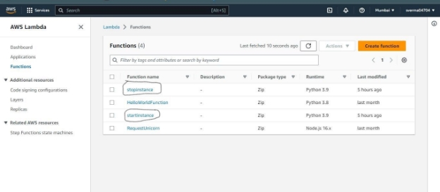
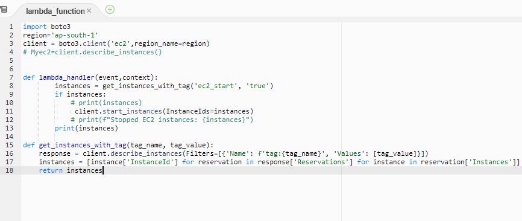
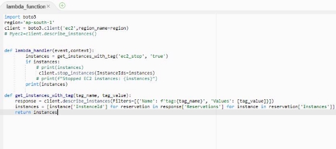
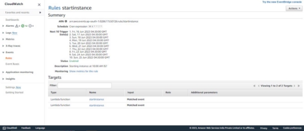
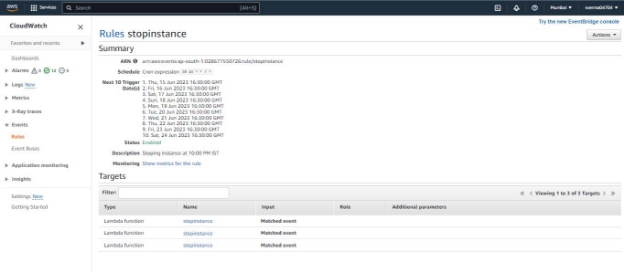

**Project: Using Lambda Function to Start & Stop the EC2 Instance Using Cloud watch Event**

**Agenda:**

- Create a function to start an ec2 instance at 10 AM IST if the instance has tag ec2\_start = "true".
- Create a function to stop an ec2 instance at 10 PM IST if the instance has tag ec2\_stop = "true".
- Outcome is ec2 instance should start or stop automatically based on cron job schedule.
- Keep the code stuff into the git repository.
- Document all the execution steps.

**Prerequisites:**

- Aws account (Servicer:**Ec2, IAM, Lambda Function, CloudWatch Events**)
- **Github Account**

**Project Architecture:**

**Execution Steps:**

1) **Create an IAM policy and execution role for your Lambda function**

a. **Create an IAM policy using the JSON policy editor**

"Version": "2012-10-17",

"Statement": [

{

"Effect": "Allow",

"Action": [

"logs:CreateLogGroup", "logs:CreateLogStream", "logs:PutLogEvents"

],

"Resource": "arn:aws:logs:\*:\*:\*"

}, {

"Effect": "Allow", "Action": [

"ec2:Start\*", "ec2:Stop\*"

],

"Resource": "\*"

}

]

}

2. **Create an IAM role for Lambda.**
- **Added StartStopec2poily (custom) and AmazonEC2FullAccess**
3) **Create Lambda functions that stop and start your EC2 instances**

a. **Open the Lambda console, and then choose the Create function.**

b. **Choose an Author from scratch.**

c. **Under Basic information, add the following information:**

**For Function name, enter a name that identifies it as the function that's used to stop your EC2 instances. For example, "StopEC2Instances".**
**For Runtime, choose Python 3.9.**
**Under Permissions, expand Change default execution role. Under Execution role, choose Use an existing role.**
**Under Existing role, choose the IAM role that we created.**

4. **Startinstance lambda function:**

5. **Stopinstance lambda function:**

6. **Test your Lambda functions**

a. **Open the Lambda console, and then choose Functions.**

b. **Choose one of the functions that you created.**

c. **Choose the Code tab.**

d. **In the Code source section, choose Test.**

e. **In the Configure test event dialog box, choose Create new test event.**

f. **Enter an Event name. Then, choose Create.**
**Note: Don't change the JSON code for the test event. The function doesn't use it.**

g. **Choose Test to run the function.**

7) **Create EventBridge rules that run your Lambda functions**

a. **Open the CLoudWatch**

b. **Select Create rule.**

**c . Enter a Name for your rule, "startinstances".**

|**Description**|**-Starting instance at 10:00 AM IST**|

d. **Enter a Name for your rule, "stopinstances".**

|**Description**|**-Stopping instance at 10:00 PM IST**|

e. **For Schedule pattern ‘start instance’,**

**Schedule Cron expression 30 4 \* \* ? \***

**For starting the instance at 4:30 GMT i.e. 10:00 AM in IST Then Lambda startinstance as target**

**f. For Schedule pattern ‘stopinstance’,**

**Schedule Cron expression 30 16 \* \* ? \***

**For stoping the instance at 16:30 GMT i.e. 10:00 PM in IST**

8) **Code Repo:**

[**Link: https://github.com/sverma41198/Start_Stop_ec2_instance**](https://github.com/sverma41198/Start_Stop_ec2_instance)

9) **Outcome:**
- **Ec2 instances with “ec2-start:true” tag started at 10:00 Am IST**
- **Ec2 instances with “ec2-stop:true” tag stopped at 10:00 PM IST**
